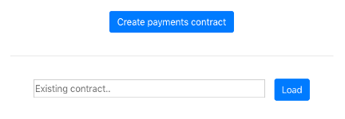
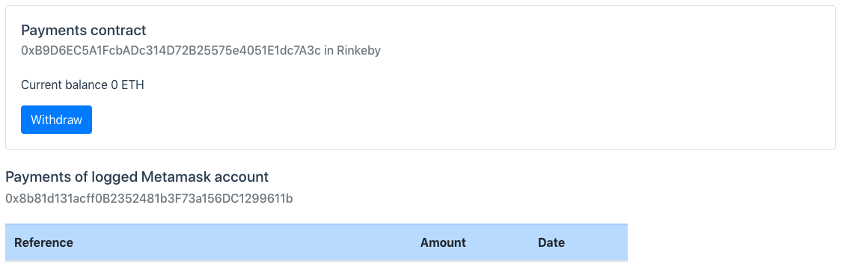
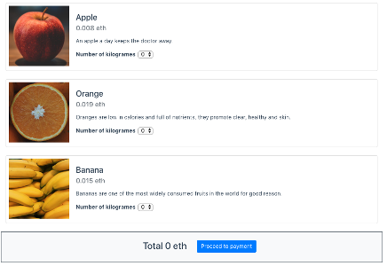
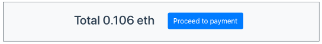
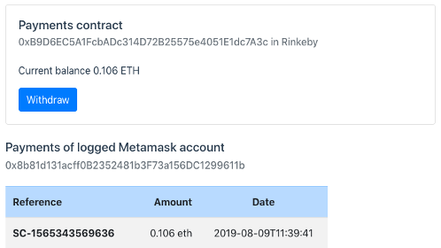
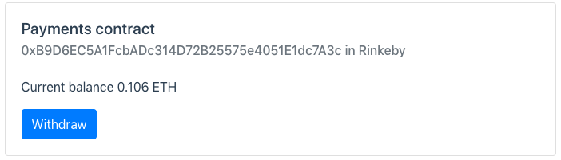

# ethereum-payment-vuejs
Simple Dapp and Vuejs app that manage payments in *ether*.  
  
The project includes the following modules:
- Ethereum Dapp to manage payments
- Shopping cart developed using Vuejs UI framework

In this project you will find:
- Example of Ethereum smart contract developed in Solidity
- Example of Vuejs app
- Example of Vuex for management of state in Vue
- Example of Vue Router for routing of Vue components

## Stack
- **Solidity** for smart contracts
- **solcjs** for compilation of smart contracts
- **Vuejs** as UI Framework (**Vuex** and **Vue Router**)
- **Bootstrap** as toolkit for styles

## Project setup
```
npm install
```

### Build Dapp smart contracts
```
npm run dapp:build
```

### Compiles and hot-reloads for development
```
npm run serve
```

### Run Dapp tests
```
npm run dapp:test
```

## Structure of the project
**/dapp/contracts**  
Sources of smart contracts (solidity code)
  
**/dapp/build**  
Json files that contain *abi* and *bytecode* generated in the compilation of smart contracts. Use **npm run dapp:build** for compilation.

**/src/views**  
Vue components. These components are mapped with routes in *router.js*

**/src/domain**  
Domain classes. In this case, code related with smart contracts in blockchain

**/src/components**  
Vue components.

## Usage

> It is required to have Metamask plugin installed in browser https://metamask.io/

1. Create Payments contract from http://localhost:8080/#/payments  



Once the contract is created in Blockchain network it is shown the detail  


2. Go to shopping cart. http://localhost:8080/#/shopping



3. Add some fruits to the basket and proceed to payment



Once the payment transaction is committed in blockchain will be redirected to the detail of payments contract. The detail will show your purchase.



4. Withdraw funds from the payments contract to the owner account. http://localhost:8080/#/payments  

